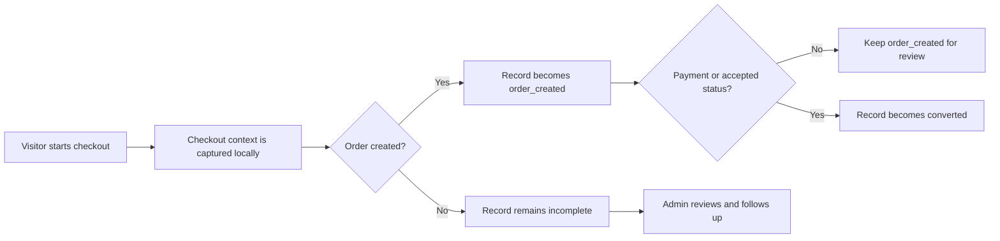

# Incomplete Order Tracker Plugin for WooCommerce

<p align="center">
  
</p>

<p align="center">
  <strong>Incomplete Order Tracker Plugin for WooCommerce — free and self-hosted.</strong><br />
  Capture incomplete checkout details locally, review product intent, and follow up from one focused WordPress dashboard.
</p>

<p align="center">
  <a href="https://github.com/joynalabddin/incomplete-orders-tracker/releases/latest"></a>
  <a href="https://github.com/joynalabddin/incomplete-orders-tracker/actions/workflows/release.yml"></a>
  <a href="https://github.com/joynalabddin/incomplete-orders-tracker/blob/main/LICENSE"></a>
  <a href="https://wordpress.org/"></a>
  <a href="https://woocommerce.com/"></a>
</p>

<p align="center">
  <a href="https://github.com/joynalabddin/incomplete-orders-tracker/releases/latest">Download the Incomplete Order Tracker Plugin</a> ·
  <a href="https://devjoynal.com/">Visit DevJoynal</a> ·
  <a href="https://github.com/joynalabddin/incomplete-orders-tracker/issues">Ask for help</a>
</p>

## Overview

**Incomplete Orders Tracker** is a free WooCommerce incomplete order tracker plugin for WordPress. It helps store owners recover checkout sessions that did not become orders. When a visitor starts entering checkout information and leaves, the plugin saves the available checkout context in the store’s own WordPress database. Administrators can then review the record, see the intended product, and choose a WhatsApp or email follow-up.

It is designed for stores that want a small, self-hosted workflow instead of a separate SaaS dashboard. The plugin is free for everyone, does not require a license key or account, and has no paid activation system. For a longer explanation, see the [Incomplete Order Tracker Plugin guide](docs/incomplete-order-tracker-plugin.md).

## What it provides

| Capability | What store owners can do |
| --- | --- |
| Checkout capture | Save available name, email, phone, address and product context while checkout is in progress. |
| Classic and Block Checkout | Use the same recovery workflow with the two main WooCommerce checkout experiences. |
| Reliable matching | Link a later WooCommerce order to the correct checkout session, with a limited email/phone fallback. |
| Recovery actions | Open a pre-filled WhatsApp message or email from the administrator dashboard. |
| Product context | Review product names and safe, same-store product links. |
| Operations dashboard | Search records, filter by state, paginate results, call a phone number, open a map, or remove a record. |
| CSV export | Export records for internal review with permission checks, nonce validation and spreadsheet-formula protection. |
| Privacy lifecycle | Configure retention and use WordPress personal-data export/erase tools for stored checkout records. |
| WooCommerce HPOS | Declares compatibility with High-Performance Order Storage and uses WooCommerce order APIs. |
| Controlled updates | Receive a WordPress update notification from a public GitHub Release and approve the update as an administrator. |

## Documentation

Start with the [Wiki Home](https://github.com/joynalabddin/incomplete-orders-tracker/wiki), then follow the [Installation Guide](https://github.com/joynalabddin/incomplete-orders-tracker/wiki/Installation-Guide). The [FAQ and Troubleshooting](https://github.com/joynalabddin/incomplete-orders-tracker/wiki/FAQ-and-Troubleshooting) page covers common store-owner questions, while [Advanced Customization and Hooks](https://github.com/joynalabddin/incomplete-orders-tracker/wiki/Advanced-Customization-and-Hooks) is intended for developers building site-specific integrations.

## How the workflow works



The browser receives a random session identifier that does not contain the visitor’s personal details. The plugin sends checkout data to the site’s own WordPress AJAX endpoint, not to DevJoynal or GitHub. An order-created event is kept separate from a paid/converted event so a pending order is not treated as a successful recovery.

## Install

1. Download `incomplete-orders-tracker.zip` from the [latest GitHub Release](https://github.com/joynalabddin/incomplete-orders-tracker/releases/latest).
2. In WordPress, open **Plugins → Add New → Upload Plugin**.
3. Upload the ZIP, select **Install Now**, and activate **Incomplete Orders Tracker**.
4. Confirm that WooCommerce is active.
5. Open **Incomplete Orders** in the WordPress admin menu and review the settings.

The normal WordPress **Activate** button only loads the plugin and prepares its local table/scheduled maintenance. There is no license validation, activation key, paid plan, external account or hidden activation service.

## First-time configuration

Open **Incomplete Orders → Settings** after installation. Set the store name and URL used in recovery messages, choose a WhatsApp country code, review the capture delay, choose a matching window, and set the retention period. The default retention period is 90 days and can be adjusted between 30 and 3,650 days.

The WhatsApp and email templates support these placeholders:

```text
{{customer_name}}
{{product_name}}
{{site_name}}
{{site_url}}
{{order_date}}
```

## Status model

| Status | Meaning |
| --- | --- |
| `incomplete` | Checkout information was captured, but no matching WooCommerce order has been created. |
| `order_created` | A WooCommerce order was created and linked, but payment/conversion is not yet confirmed. |
| `converted` | Payment completed or the order reached an accepted processing/completed state. |
| `complete` | An administrator manually closed the visible recovery record. |

## Privacy and data handling

The plugin stores checkout contact fields, address data, product context, timestamps and the visitor IP address in the site’s own WordPress database. The information is collected so the store administrator can follow up on an incomplete checkout. The site owner should publish an appropriate privacy notice, select a retention period, and explain the recovery workflow to visitors.

WordPress administrators can use the built-in personal-data export and erase tools for matching checkout records. Recovery buttons open WhatsApp, the administrator’s email client or Google Maps only after the administrator chooses the relevant action. The plugin does not transmit captured checkout data to Joynal Abdin, DevJoynal, GitHub or an external dashboard.

## Updates

Updates are distributed through public, versioned GitHub Releases. When a newer release is available, WordPress shows an update notification on the Plugins or Updates screen. The administrator reviews and approves the update; the plugin does not silently replace itself.

For each release, the repository workflow creates an asset named exactly `incomplete-orders-tracker.zip`. A release version must be newer than the previous semantic version tag, for example `v1.1.0` followed by `v1.1.1`. WordPress may cache update checks, so a notification can appear after the release rather than at the exact publication second.

## Requirements and compatibility

| Requirement | Supported baseline |
| --- | --- |
| WordPress | 6.2 or newer |
| PHP | 7.4 or newer |
| WooCommerce | Active installation required |
| Checkout | Classic Checkout and WooCommerce Block Checkout |
| Storage | WordPress database with WooCommerce HPOS compatibility declaration |
| Security | HTTPS is strongly recommended for checkout |

Before production rollout, test the plugin on a staging site with the store’s payment gateway, Classic Checkout, Block Checkout, HPOS enabled/disabled, pending orders, failed payments and successful payments.

## Common questions

### Is the Incomplete Order Tracker Plugin free?

Yes. It is free for everyone and has no license key, activation key, paid plan or remote license server. WordPress’s normal plugin activation is still required to load the plugin, as with every WordPress plugin.

### Does the plugin require a license key?

No. There is no license system at all. The plugin is free for everyone; WordPress’s normal plugin activation is only required to load the plugin.

### Does it send customer data to an external service?

No during capture. Checkout data is stored in the site’s own database. WhatsApp, email and Google Maps open only when an administrator intentionally clicks a recovery action.

### Does it work with WooCommerce Block Checkout?

The plugin includes Classic Checkout and Block Checkout hooks. A staging test is still recommended because checkout extensions and payment gateways can customize field rendering and order timing.

### Why is an order-created record not immediately marked converted?

Creating a WooCommerce order and completing payment are not always the same event. Keeping those states separate makes the recovery dashboard more accurate for pending or failed payments.

### How do I report a security issue?

Please avoid posting exploitable details in a public issue. Follow the guidance in [SECURITY.md](SECURITY.md) and contact Joynal Abdin through [devjoynal.com](https://devjoynal.com).

## Development

The plugin source is in [`incomplete-orders-tracker/`](incomplete-orders-tracker/). Before a release, run PHP lint, JavaScript syntax checks, the smoke test, legacy-reference scans and a WordPress/WooCommerce staging test. The GitHub Actions workflow packages the plugin and publishes a Release asset when the version is newer than the latest tag.

## Support and website

For WordPress development, WooCommerce recovery workflows, security hardening, migration and performance work, visit **[devjoynal.com](https://devjoynal.com)**. Bugs, questions and feature suggestions belong in the repository’s [Issues](https://github.com/joynalabddin/incomplete-orders-tracker/issues) area.

## License

This project is released under the [GPLv2 or later](LICENSE). It is free software and does not require a license key or activation key.

## Author

**Joynal Abdin**  
[devjoynal.com](https://devjoynal.com)
